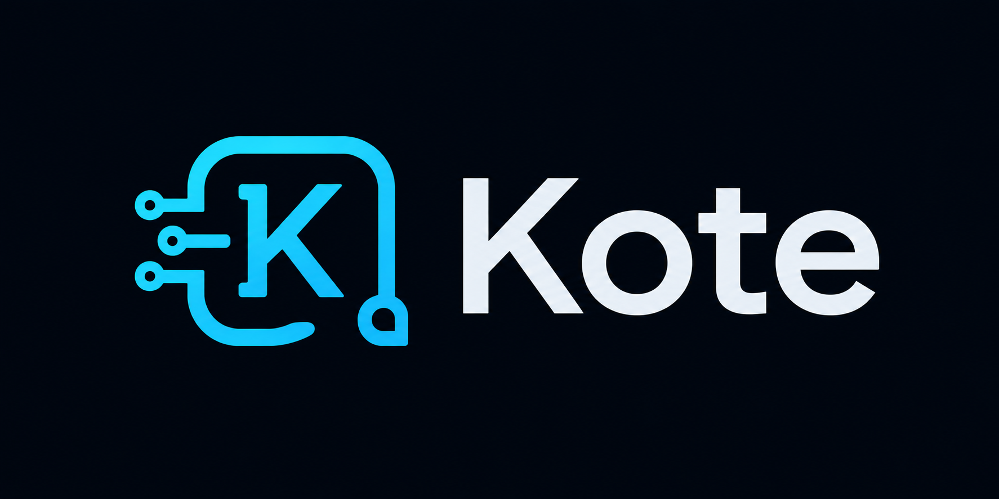
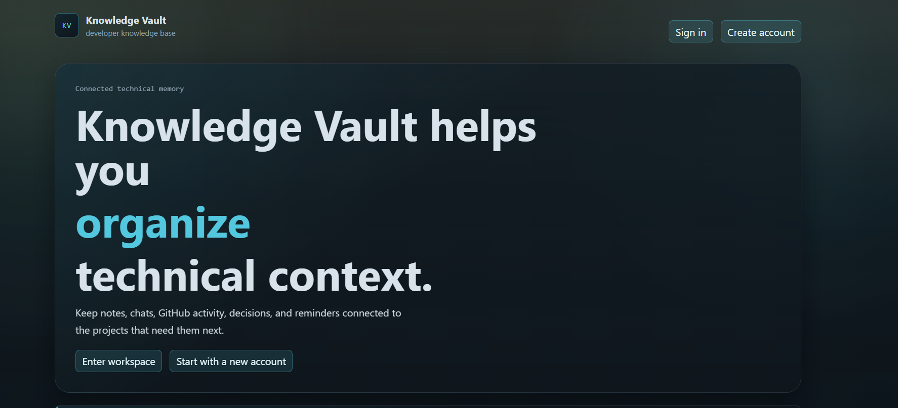
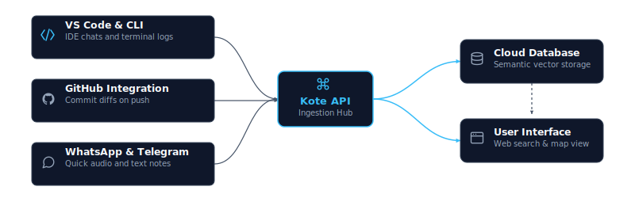
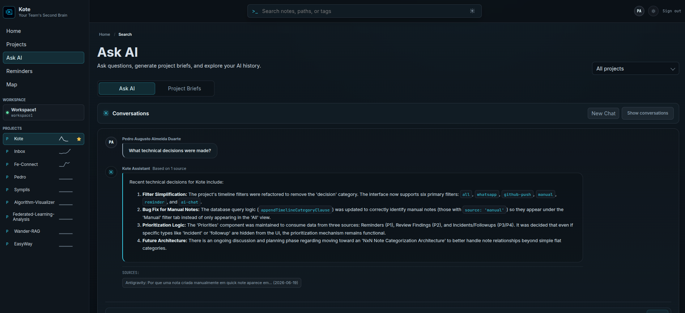
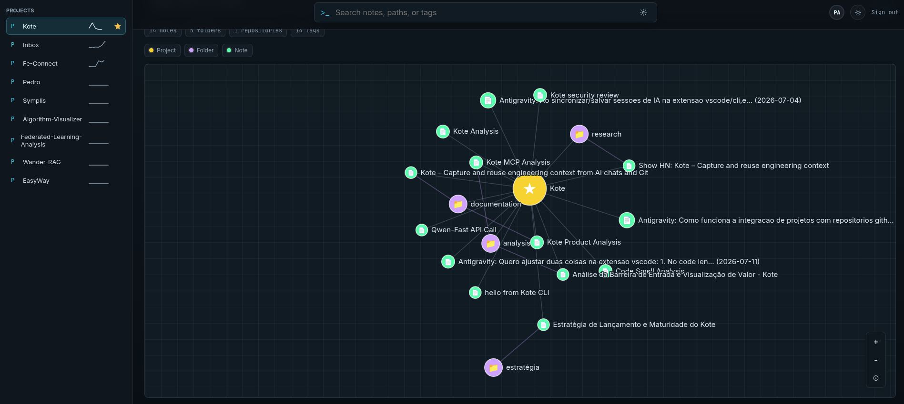
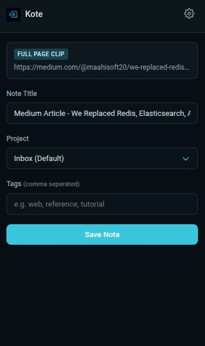
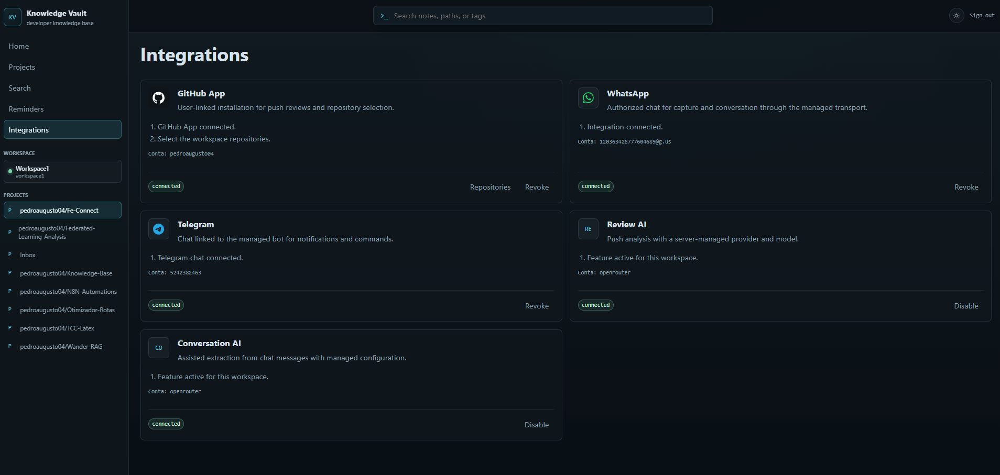

<p align="center">
  
</p>

<p align="center">
  <a href="https://github.com/pedroaugusto04/knowledge-base/actions/workflows/deploy.yml"></a>
  
  
  
  
  
</p>

<!-- Topics: developer-tools, knowledge-base, ai-integration, productivity, typescript, nestjs, react, git-integration, code-documentation, pwa -->

<p align="center">
  A developer memory layer that automatically captures and organizes AI sessions, Git history, and development context into searchable knowledge.
  <br><br>
  <a href="https://knowledgebase.sbs/kote">→ Open Kote Web App</a>
  <br><br>
  Available as cloud or self-hosted.
</p>

<p align="center">
  <a href="https://knowledgebase.sbs/kote">Web Application</a> • 
  <a href="#getting-started">Getting Started</a> • 
  <a href="#how-it-works">How It Works</a>
</p>

<p align="center">
  
</p>

---

## Demos

### Kote Overview

<p align="center">
  
  <br><em>Kote: capturing development context and querying knowledge.</em>
</p>

### CodeLens Integration

<p align="center">
  
  <br><em>VS Code CodeLens showing related notes at the top of files.</em>
</p>

---

## Overview

Software development generates a high volume of technical context that rarely makes it into formal documentation:
* Complex problem-solving discussions held with AI coding assistants (Claude Code, Copilot, ChatGPT).
* Rationale behind architectural changes, which is often omitted in brief commit messages.
* Infrastructure exceptions, environment configurations, and setup notes.

Kote is designed to passively capture these workflows, organizing them into a unified knowledge base that can be used to ask questions, retrieve past decisions, and explore technical context when needed.

---

## How It Works

Kote integrates with your existing tools to collect and index technical knowledge automatically:

<picture>
  <source media="(prefers-color-scheme: dark)" srcset="docs/diagram-dark-horizontal.svg">
  <source media="(prefers-color-scheme: light)" srcset="docs/diagram-light-horizontal.svg">
  
</picture>

1. **Development & AI Sessions:** The VS Code extension automatically logs local AI conversations and saves highlighted code snippets to your knowledge base.
2. **Git Workflow:** The GitHub integration analyzes commit diffs on push, generating technical summaries and flagging potential operational issues.
3. **Quick Notes:** Send text or audio messages to Kote's messaging integrations to log quick notes or environment configurations.
4. **CodeLens Integration:** When opening files in VS Code, a CodeLens indicator appears at the top of files that have associated notes or decisions in your Kote, allowing you to quickly access relevant context without leaving your editor.
5. **Query & Retrieval:** Query the accumulated knowledge base using natural language directly from the Web Application, the VS Code sidebar, WhatsApp or via CLI to ask questions or locate solutions, documents, and files.

---

## Getting Started

To start using Kote:

1. **Sign In:** Go to [knowledgebase.sbs/kote](https://knowledgebase.sbs/kote) and authenticate your account.

2. **Configure Integrations:** Connect your repository hosting (GitHub) via the Integrations dashboard in the web application.

3. **Install the VS Code Extension:**
   Install **Kote** from the VS Code Marketplace and sign in. Kote passively captures AI sessions in the background and lets you query your knowledge base using AI directly from VS Code.
     
4. **Start Capturing Context Automatically:**
Once set up, Kote runs in the background and continuously captures AI sessions (Antigravity, Codex, Claude Code, OpenCode, etc.), GitHub activity (pushes and pull requests), and development context. Everything you work on becomes searchable knowledge that you can query to understand what you've done, why decisions were made, and how your system evolved over time.

5. **Access Related Notes in Your IDE:**
When you open files in VS Code that have associated notes or decisions in your Kote, a CodeLens indicator appears at the top of the file showing the count of related notes. Click the indicator to view and open these notes directly in your editor, making it easy to access relevant context and decisions without leaving your development environment.

> [!TIP]
> **CodeLens not working?** Make sure CodeLens is enabled in your VS Code settings (`"editor.codeLens": true`). It's enabled by default, but may have been disabled globally.

---

<details>
<summary><strong>Self-Hosting (Docker)</strong></summary>

If you prefer to run Kote on your own infrastructure or local machine, you can launch the entire stack using Docker Compose:

1. **Clone the Repository:**
   ```bash
   git clone https://github.com/pedroaugusto04/knowledge-base.git
   cd knowledge-base
   ```

2. **Configure Environment Variables:**
   Copy the example environment file:
   ```bash
   cp .env.example .env
   ```
   Open the `.env` file and configure the **essential keys** to enable core features:
   * **Admin Credentials:** Change `KB_ADMIN_EMAIL` and `KB_ADMIN_PASSWORD` (used for your initial login).
   * **AI Integrations (Search/Chat/Voice):** Set `KB_AUDIO_AI_API_KEY` and `KB_EMBEDDING_AI_API_KEY` (Gemini API key is the default and highly recommended).
   * **File Storage:** Fill in `SUPABASE_URL`, `SUPABASE_SERVICE_ROLE_KEY`, and `KB_SUPABASE_STORAGE_BUCKET` to store notes and attachments.

3. **Start Services:**
   Launch the database, message broker, backend API, and web application (database migrations will run automatically on startup):
   ```bash
   docker compose up -d
   ```

Once running, access the local services:
* **Web Application:** [http://localhost:4311](http://localhost:4311)
* **API Server:** [http://localhost:4310](http://localhost:4310)

</details>

> [!TIP]
> Point your VS Code Extension (`knowledgeVault.apiUrl`) or CLI (`apiUrl` in `~/.kb-config.json`) to your self-hosted API URL (`http://localhost:4310`) to connect your editor and terminal to your local instance.

---

## Features

<details>
<summary><strong>Web Application & Knowledge Map</strong></summary>

Interfaces to manage, search, and visualize captured knowledge.

<p align="center">

<p align="center">
  
  <br><em>Semantic chat interface for querying indexed data.</em>
</p>

<p align="center">
  
  <br><em>Detailed view of a captured note with metadata and tags.</em>
</p>

<p align="center">
  
  <br><em>Visual node graph illustrating relations between projects and notes.</em>
</p>

</details>

---

<details>
<summary><strong>VS Code Extension</strong></summary>

Integrates directly with your editor to capture context during development.

<p align="center">
  
  <br><em>Integrated sidebar containing AI chat and quick-save options.</em>
</p>

**Key Features:**
- **CodeLens Integration**: Automatically displays relevant notes and decisions at the top of files that have associated knowledge in your Kote. Click the CodeLens indicator to view and open related notes directly in your editor.
- **AI Chat Sidebar**: Interactive AI chat interface for querying your knowledge base without leaving the editor.
- **Quick Save Commands**: Save code selections or entire files as notes with right-click context menus.
- **AI Session History**: View and search recent AI-assisted development sessions from various tools.
- **Real-time Sync**: Monitor and sync local AI CLI sessions automatically in the background.

For configuration details, see [ide/vscode/README.md](ide/vscode/README.md).

</details>

---

<details>
<summary><strong>GitHub Integration</strong></summary>

Processes repository activity passively to record code changes and retrieve context.

* **Diff Analysis:** Summarizes changes on every push.
* **Onboarding Backfill:** After linking a repository, users can opt in to import recent commits as review notes. Configure the offer size with `KB_GITHUB_BACKFILL_LIMIT` (default: `5`). Each imported commit consumes AI credits like a normal push review.
* **Alert System:** Notifies the team via WhatsApp or Telegram if potential configuration or environmental issues are detected in a diff.
* **PR Context AI:** Analyzes changed files and title/description of newly opened Pull Requests to automatically retrieve historical technical decisions and context, posting it as a PR comment.

</details>

---

<details>
<summary><strong>CLI Tool (kote)</strong></summary>

Synchronize terminal session histories and import local directories or files.

<p align="center">
  
  <br><em>Importing AI session history from the terminal.</em>
</p>

For installation steps and command options, see [cli/README.md](cli/README.md).

</details>

---

<details>
<summary><strong>Browser Extension</strong></summary>

Save documentation, issues, and articles directly from the web browser.

<p align="center">
  
  <br><em>Browser extension popup for saving web content.</em>
</p>

For setup instructions, see [ide/browser-extension/README.md](ide/browser-extension/README.md).

</details>

---

<details>
<summary><strong>Model Context Protocol (MCP) Server</strong></summary>

Provides developer memory retrieval and persistence directly to AI assistants (such as Cursor, Claude Desktop, Cline, and Antigravity).

**Key Features:**
- **kote_search_notes**: Search developer notes, design decisions, and PR summaries using hybrid keyword and vector search, returning optimized snippets.
- **kote_get_note**: Fetch the full Markdown body of a specific note by ID.
- **kote_create_note**: Persistently save important development decisions or notes straight into your Kote memory graph.

**Integration Quick Start:**
You can run the Kote MCP Server directly from npm using `npx`:
```json
{
  "mcpServers": {
    "kote": {
      "command": "npx",
      "args": ["-y", "@pedroaugusto04/kote-mcp"]
    }
  }
}
```

For advanced configuration and setup, see [ide/mcp/README.md](ide/mcp/README.md).

</details>

---

<details>
<summary><strong>Messaging Integrations (WhatsApp & Telegram)</strong></summary>

Provides channels for logging quick notes and querying the database.

<p align="center">
  
  <br><em>Configuration dashboard for WhatsApp, Telegram, and GitHub integrations.</em>
</p>

* **Audio Notes:** Transcribes and structures voice recordings into Markdown notes.
* **Image Capture:** Upload screenshots or whiteboard diagrams to attach to projects.
* **Interactive Querying:** Search the knowledge base using the `/ask` command.

</details>

---

## License

See [LICENSE](LICENSE) for terms of use.
