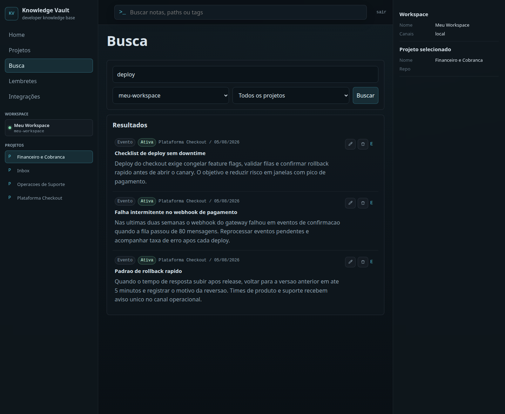

# Knowledge Vault

Knowledge Vault centralizes your team's operational knowledge in one place, preventing the loss of critical context and decisions.

## Overview
Transform scattered information into a searchable knowledge base by automatically capturing daily learnings, decisions, and pending tasks.

## Key Features
- **Project Organization:** Notes, routines, and decisions centralized by context.
- **Contextual Search:** Instantly find answers across the team's entire history.
- **Operational Dashboard:** A quick summary of recent activities, priorities, and reminders.
- **Continuous Capture:** Direct integration with the tools your team already uses.

## Integrations
We simplify knowledge capture where the work already happens:

- **WhatsApp:** Send texts or audio directly to the Vault. The system automatically identifies the project and generates structured notes without manual effort.
- **GitHub Push:** Captures `git push` events, analyzes commits and diffs, and transforms technical updates into accessible context for everyone, not just developers.

## Why Knowledge Vault?
- **Zero context loss:** Perfect for shift handovers or new projects.
- **Accelerated onboarding:** New members can find the complete history in seconds.
- **Single source of truth:** A reliable record of decisions and operational exceptions.

## Quick Start (2 Minutes)
1. Create your **Workspace**.
2. Register your **Projects**.
3. Connect your channels (**WhatsApp/GitHub**).
4. Start capturing and searching!

---

### Extras

*Search interface and context recovery.*

*Integration setup and configuration panel.*