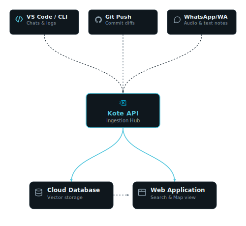

<p align="center">
  
</p>

<p align="center">
  <a href="https://github.com/pedroaugusto04/knowledge-base/actions/workflows/deploy.yml"></a>
  
  
  
  
  
</p>

<p align="center">
  <strong>Continuous operational knowledge capture for development teams.</strong><br>
  Kote aggregates technical decisions, AI coding sessions, and codebase updates into a centralized, searchable index.
</p>

<p align="center">
  <a href="https://knowledgebase.sbs/kote">Web Application</a> • 
  <a href="#getting-started">Getting Started</a> • 
  <a href="#how-it-works">How It Works</a>
</p>

<p align="center">
  
</p>

---

## Overview

Software development generates a high volume of technical context that rarely makes it into formal documentation:
* Complex problem-solving discussions held with AI coding assistants (Claude Code, Copilot, ChatGPT).
* Rationale behind architectural changes, which is often omitted in brief commit messages.
* Infrastructure exceptions, environment configurations, and setup notes.

Kote is designed to capture these workflows passively, organizing them into a unified knowledge base without requiring developers to write traditional documentation from scratch.

---

## How It Works

Kote integrates with your existing tools to collect and index technical knowledge automatically:

<picture>
  <source media="(prefers-color-scheme: dark)" srcset="docs/diagram-dark.svg">
  <source media="(prefers-color-scheme: light)" srcset="docs/diagram-light.svg">
  
</picture>

1. **Development & AI Sessions:** The VS Code extension automatically logs local AI conversations and saves highlighted code snippets to your knowledge base.
2. **Git Workflow:** The GitHub integration analyzes commit diffs on push, generating technical summaries and flagging potential operational issues.
3. **Quick Notes:** Send text or audio messages to Kote's messaging integrations to log quick notes or environment configurations.
4. **Query & Retrieval:** Query the accumulated knowledge base using natural language directly from the Web Application, the VS Code sidebar, WhatsApp or via CLI to ask questions or locate solutions, documents, and files.

---

## Getting Started

To start using Kote:

1. **Sign In:** Go to [knowledgebase.sbs/kote](https://knowledgebase.sbs/kote) and authenticate your account.
2. **Configure Integrations:** Connect your repository hosting (GitHub) and messaging channels (WhatsApp or Telegram) via the Integrations dashboard in the web application.
3. **Install Client Tools:** 
   * **VS Code Extension:** Install **Kote** from the VS Code Marketplace to log AI chats and snippets.
   * **Browser Extension:** Install the Chrome/Firefox extension to clip web documentation.
   * **CLI:** Run `npm install -g @pedroaugusto04/kote-cli` to synchronize terminal agent logs or documentation files.

---

## Self-Hosting (Docker)

If you prefer to run Kote on your own infrastructure or local machine, you can launch the entire stack using Docker Compose:

1. **Clone the Repository:**
   ```bash
   git clone https://github.com/pedroaugusto04/knowledge-base.git
   cd knowledge-base
   ```

2. **Configure Environment Variables:**
   Copy the example environment file:
   ```bash
   cp .env.example .env
   ```
   Open the `.env` file and configure the **essential keys** to enable core features:
   * **Admin Credentials:** Change `KB_ADMIN_EMAIL` and `KB_ADMIN_PASSWORD` (used for your initial login).
   * **AI Integrations (Search/Chat/Voice):** Set `KB_AUDIO_AI_API_KEY` and `KB_EMBEDDING_AI_API_KEY` (Gemini API key is the default and highly recommended).
   * **File Storage:** Fill in `SUPABASE_URL`, `SUPABASE_SERVICE_ROLE_KEY`, and `KB_SUPABASE_STORAGE_BUCKET` to store notes and attachments.

3. **Start Services:**
   Launch the database, message broker, backend API, and web application (database migrations will run automatically on startup):
   ```bash
   docker compose up -d
   ```

Once running, access the local services:
* **Web Application:** [http://localhost:4311](http://localhost:4311)
* **API Server:** [http://localhost:4310](http://localhost:4310)

> [!TIP]
> Point your VS Code Extension (`knowledgeVault.apiUrl`) or CLI (`apiUrl` in `~/.kb-config.json`) to your self-hosted API URL (`http://localhost:4310`) to connect your editor and terminal to your local instance.

---

## Features

### CLI Tool (kote)

Synchronize terminal session histories and import local directories or files.

<p align="center">
  
  <br><em>Importing AI session history from the terminal.</em>
</p>

For installation steps and command options, see [cli/README.md](cli/README.md).

---

### VS Code Extension

Integrates directly with your editor to capture context during development.

<p align="center">
  
  <br><em>Integrated sidebar containing AI chat and quick-save options.</em>
</p>

For configuration details, see [ide/vscode/README.md](ide/vscode/README.md).

---

### Browser Extension

Save documentation, issues, and articles directly from the web browser.

<p align="center">
  
  <br><em>Browser extension popup for saving web content.</em>
</p>

For setup instructions, see [ide/browser-extension/README.md](ide/browser-extension/README.md).

---

### GitHub Push Integration

Processes repository activity passively to record code changes.

* **Diff Analysis:** Summarizes changes on every push.
* **Alert System:** Notifies the team via WhatsApp or Telegram if potential configuration or environmental issues are detected in a diff.

---

### Messaging Integrations (WhatsApp & Telegram)

Provides channels for logging quick notes and querying the database.

<p align="center">
  
  <br><em>Configuration dashboard for WhatsApp, Telegram, and GitHub integrations.</em>
</p>

* **Audio Notes:** Transcribes and structures voice recordings into Markdown notes.
* **Image Capture:** Upload screenshots or whiteboard diagrams to attach to projects.
* **Interactive Querying:** Search the knowledge base using the `/ask` command.

---

### Web Application & Knowledge Map

Interfaces to manage, search, and visualize captured knowledge.

<p align="center">
  
  <br><em>Semantic chat interface for querying indexed data.</em>
</p>

<p align="center">
  
  <br><em>Detailed view of a captured note with metadata and tags.</em>
</p>

<p align="center">
  
  <br><em>Visual node graph illustrating relations between projects and notes.</em>
</p>

---

## License

See [LICENSE](LICENSE) for terms of use.
