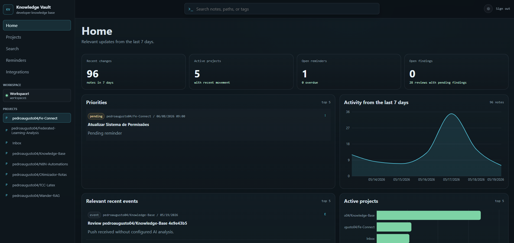
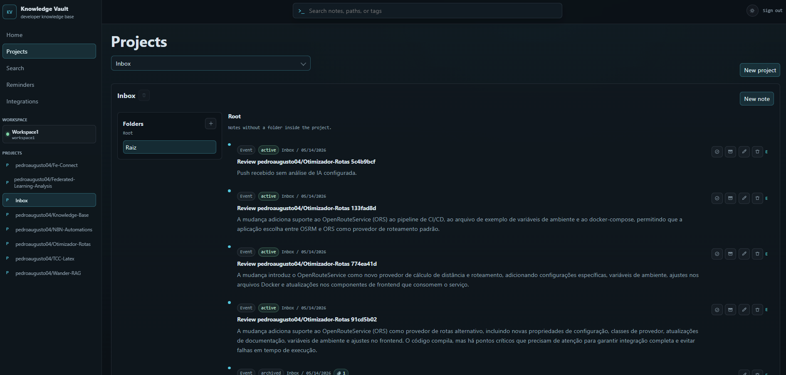

# Knowledge Vault

O **Knowledge Vault** centraliza o conhecimento operacional e as decisões do seu time em um único lugar, evitando a fragmentação do conhecimento e acelerando a integração de novas pessoas no fluxo de trabalho.


---

## Benefícios
* **Zero Perda de Contexto:** Histórico completo de decisões, rotinas e exceções operacionais.
* **Onboarding Acelerado:** Novos membros encontram todo o histórico do projeto em segundos.
* **Captura Invisível:** O conhecimento é registrado onde o trabalho já acontece (WhatsApp, Telegram, GitHub).

---

## Funcionalidades Principais
* **Dashboard Operacional:** Visão unificada das atividades recentes, prioridades e lembretes ativos.
* **Kanban de Lembretes:** Quadro operacional para cartões pendentes, atrasados, resolvidos e arquivados.
* **Busca Contextual:** Encontre respostas instantaneamente em todo o histórico da organização.
* **Ask AI & Histórico:** Interface de chat com IA integrada, incluindo filtros por projeto e paginação do histórico de perguntas por usuário.
* **Briefing de Projeto:** Resumos técnicos operacionais gerados automaticamente por IA a partir dos últimos itens do projeto.

---

## Integrações
* **WhatsApp:** Envie áudios ou textos para gerar notas estruturadas por IA. Receba lembretes automáticos integrados via *Evolution API* (`whatsappChatJid`).
* **Telegram:** Receba alertas de falhas em pipelines, resumos de revisões e interaja diretamente com o bot.
* **GitHub Push:** Captura eventos de `git push`, analisa commits/diffs por IA e envia um resumo técnico acessível para o canal do Telegram e para a base.

---

## CLI & Sincronização Local (`kb`)
O CLI oficial permite interagir com o Knowledge Vault diretamente do terminal e sincronizar arquivos locais.

### Instalação e Inicialização
```bash
npm install -g @pedroaugusto04/kb-cli
kb init
```

### Principais Comandos
* **Sincronizar Diretório ou Arquivo:**
  ```bash
  kb sync --dir ./docs --project meu-projeto
  kb sync --dir ./README.md --project meu-projeto
  ```
* **Flags Úteis:**
  * `--watch` ou `-w`: Monitoramento e sincronização em tempo real.
  * `--dry-run`: Simula a sincronização sem realizar alterações no servidor.

> [!NOTE]
> A sincronização é inteligente (idempotente) através do arquivo local `.kb-sync.json`, injetando automaticamente o `id` da nota no frontmatter YAML dos arquivos Markdown sincronizados.

---

## Executando com Docker

### 1. Configurar variáveis de ambiente
Crie um arquivo `.env` na raiz do projeto contendo as credenciais necessárias baseado no `.env.example`.

### 2. Iniciar os serviços
Suba todos os containers necessários (PostgreSQL, RabbitMQ, API e Frontend):
```bash
docker compose up
```

### 3. Rodar as migrações do banco
Com os containers ativos, execute as migrações:
```bash
docker compose exec api npm run migrate
```

A aplicação estará disponível em:
* **Frontend:** [http://localhost:4311](http://localhost:4311)
* **API:** [http://localhost:4310](http://localhost:4310)

---

## Capturas de Tela

<p align="center">
  
  <br><em>Dashboard operacional com atividades recentes e projetos ativos.</em>
</p>

<p align="center">
  
  <br><em>Painel de configuração guiada de integrações.</em>
</p>

<p align="center">
  
  <br><em>Visualização e organização de notas dentro do workspace.</em>
</p>
