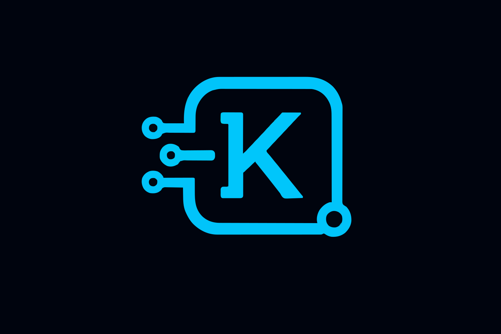

<p align="center">
  
</p>

# kote-cli

CLI client for the Kote AI system - interact with your Kote directly from the terminal.

## About Kote

**Kote** is a developer memory layer that automatically captures and organizes AI sessions, Git history, and development context into searchable knowledge.

For more details, visit the [GitHub Repository](https://github.com/pedroaugusto04/Kote) or the [original link](https://knowledgebase.sbs/kote).

## About kote-cli

`kote-cli` is the official command-line interface for Kote. It allows you to sync local files and directories, capture AI session histories, and interact with your Kote without leaving your terminal.

Perfect for automating knowledge capture in CI/CD pipelines, local development scripts, or any workflow where the terminal is your primary interface.


## Installation

```bash
npm install -g @pedroaugusto04/kote-cli
```

## Quick Start

### Get Help

```bash
kote
help

or 

kote --help
```

### Initialize Configuration

```bash
kote init
```

This will prompt you for your Kote instance URL and credentials, creating a configuration file in your home directory.

### Sync AI Session History (Primary Feature)

```bash
# Interactive session selection
kote sync-ai
```

This will scan for AI sessions and prompt you to select which ones to import.

### Sync Files to Kote (Optional)

```bash
# Sync an entire directory
kote sync --dir ./docs --project my-project

# Sync a single file
kote sync --file ./README.md --project my-project

# Sync with real-time monitoring
kote sync --dir ./src --project my-project --watch
```

## Key Commands

### `kote init`

Initialize CLI configuration. Prompts for:
- Kote API URL
- API credentials (email/password or token)
- Default project (optional)

### `kote sync`

Sync local files or directories to your Kote.

**Options:**
- `--dir <path>`: Sync a directory
- `--file <path>`: Sync a single file
- `--project <name>`: Target project name
- `--watch, -w`: Monitor for changes and sync in real-time
- `--dry-run`: Simulate sync without making changes

**Examples:**
```bash
# Sync documentation folder
kote sync --dir ./docs --project documentation

# Sync specific configuration file
kote sync --file ./package.json --project infrastructure

# Watch and sync changes automatically
kote sync --dir ./src --project backend --watch

# Test what would be synced
kote sync --dir ./docs --project docs --dry-run
```

### `kote sync-ai`

Sync AI-assisted development session histories to preserve valuable insights.

**Options:**
- `--session-path <path>`: Path to AI session directory
- `--project <name>`: Target project name
- `--watch, -w`: Monitor for new sessions

**Supported AI Tools:**
- Claude Code (`~/.claude/sessions`)
- Codex CLI (`~/.codex/sessions`)
- Custom session directories

**Examples:**
```bash
# Sync Claude Code sessions
kote sync-ai --session-path ~/.claude/sessions --project ai-experiments

# Monitor for new sessions automatically
kote sync-ai --session-path ~/.claude/sessions --project ai-work --watch
```

## Screenshots

<p align="center">
  
  <br><em>Command-line interface for syncing files and interacting with Kote.</em>
</p>

<p align="center">
  
  <br><em>Example of syncing AI session history to central vault.</em>
</p>

## Use Cases

### CI/CD Integration
Automatically capture build artifacts, deployment notes, and configuration changes:

```bash
# In your CI pipeline
kote sync --dir ./build-artifacts --project deployments
kote sync --file ./CHANGELOG.md --project releases
```

### Documentation Workflow
Keep documentation in sync with your Kote:

```bash
# Watch docs folder for changes
kote sync --dir ./docs --project documentation --watch
```

### AI Session Archiving
Preserve valuable AI-assisted development sessions:

```bash
# Archive Claude Code sessions as searchable knowledge
kote sync-ai --session-path ~/.claude/sessions --project development-history
```


## Links

- [Main Project Documentation](../README.md)
- [VS Code Extension](../ide/vscode/README.md)
- [Kote Repository](https://github.com/pedroaugusto04/knowledge-base)

## License

See [LICENSE](../LICENSE) for terms of use.